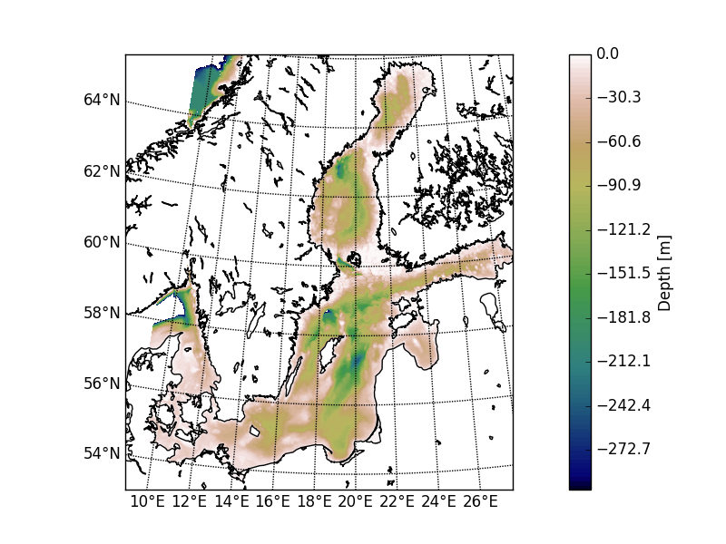

On June 6 I will give a talk at Rostock 365° about my current research at the Institute for Baltic Sea Research (IOW). The contest is called Rostock's Eleven, representing the 11 scientific institutes located in Rostock. Each institute is represented by one participant and I am really proud that I have the chance to represent IOW.

**The Baltic Sea from the perspective of a computational oceangrapher**

My talk will be about the Baltic Sea and how it has changed during in the last 1000 years. 
During the last 1000 years the Baltic Sea sea experienced a warm period, called the Medivial Climate Anomaly (950 - 1400) and a cold period, called the Little Ice Age (1400 - 1700). In my talk I will try to answer questions about how the Baltic Sea changed during these periods from the perspective of a computational oceanographer.

## Further information:

You can find the german abstract here:

[PDF Link](https://www.rostock365.de/sites/default/files/redakteure/PDFs/R11_Kurzmappe_2019.pdf)

